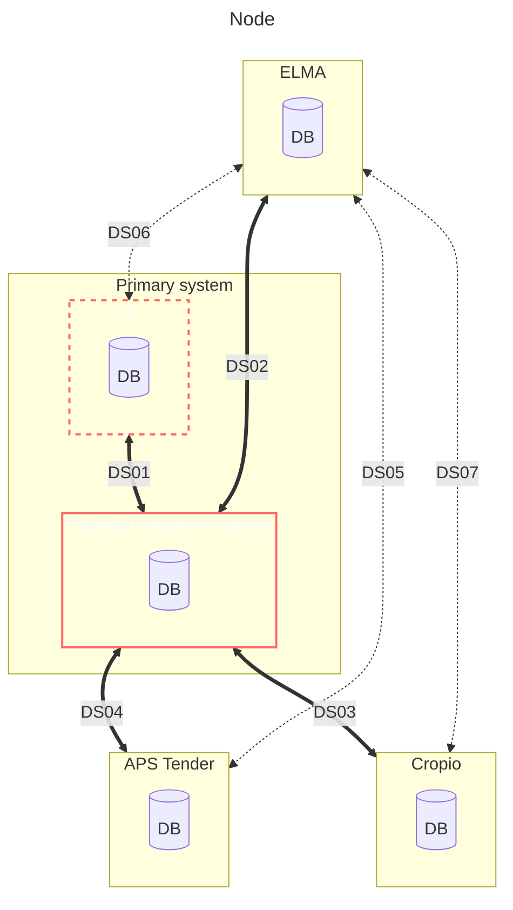

```mermaid
---
title: Node
---
flowchart TD
    subgraph PS ["Primary system"]
        subgraph OneS ["1С"]
        OneS_DB[(DB)]
        end

        subgraph GDS["Сервер глобальних даних"]
        KGDS_DB[(DB)]
        end
    end
    
    
    subgraph Elma ["ELMA"]
    Elma_DB[(DB)]
    end

    subgraph Cropio ["Cropio"]
    Cropio_DB[(DB)]
    end

    subgraph Aps ["APS Tender"]
    Aps_DB[(DB)]
    end
    
    
    OneS <==>|DS01| GDS
    GDS <==>|DS02| Elma
    GDS <==>|DS03| Cropio
    GDS <==>|DS04| Aps
    Elma <-.->|DS05| Aps
    Elma <-.->|DS06| OneS
    Elma <-.->|DS07| Cropio
    
    style GDS stroke:#f66,stroke-width:2px,color:#fff
    style OneS stroke:#f66,stroke-width:2px,color:#fff,stroke-dasharray: 5 5
```

**Перелік глобальних даних:**
- [ ] Робітник
- [ ] Посада
- [ ] Підприємство
- [ ] Стаття б'юджету
- [ ] Группа номенклатури
- [ ] Номенклатура
