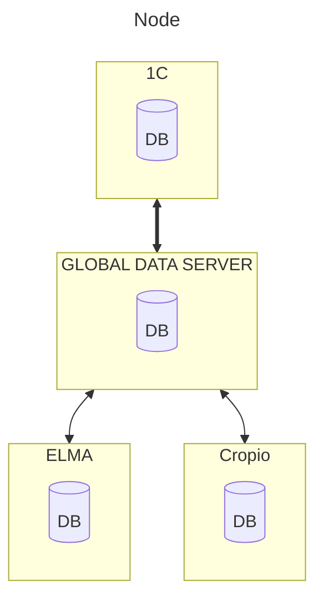

```mermaid
---
title: Node
---
flowchart TB
    subgraph OneS ["1С"]
    OneS_DB[(DB)]
    end
    
    subgraph GDS ["GLOBAL DATA SERVER"]
    KGDS_DB[(DB)]
    end
    
    subgraph Elma ["ELMA"]
    Elma_DB[(DB)]
    end
    
    subgraph Cropio ["Cropio"]
    Cropio_DB[(DB)]
    end
    
    OneS <==> GDS
    GDS <--> Elma
    GDS <--> Cropio
```
