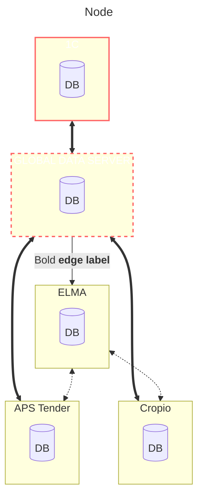

```mermaid
---
title: Node
---
flowchart TD
    subgraph OneS ["1С"]
    OneS_DB[(DB)]
    end
    
    style OneS stroke:#f66,stroke-width:2px,color:#fff
    
    subgraph GDS["GLOBAL DATA SERVER"]
    KGDS_DB[(DB)]
    end
    
    style GDS stroke:#f66,stroke-width:2px,color:#fff,stroke-dasharray: 5 5
    
    subgraph Elma ["ELMA"]
    Elma_DB[(DB)]
    end
    
    subgraph Cropio ["Cropio"]
    Cropio_DB[(DB)]
    end
    
    subgraph Aps ["APS Tender"]
    Aps_DB[(DB)]
    end
    
    OneS <==> GDS
    GDS -- "`Bold **edge label**`" --> Elma
    GDS <==> Cropio
    GDS <==> Aps
    Elma <-.-> Aps
    Elma <-.-> Cropio
```
